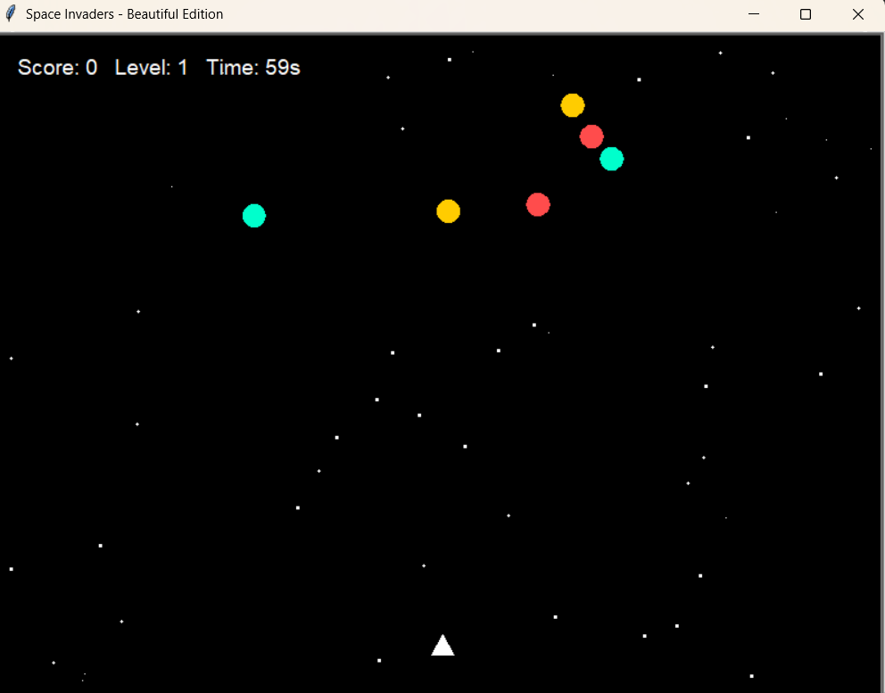

Space Invaders – Beautiful Edition

This is a Python Turtle Graphics implementation of a retro-style Space Invaders game. It includes animations, background stars, sound effects (optional), scoring, levels, and a timer.

🎮 How the Game Works

You control a spaceship (the Player) at the bottom of the screen.

Use the Left and Right Arrow keys to move your ship.

Press Space to fire bullets.

Enemies move across the screen with a wobbling pattern.

If a bullet hits an enemy:

A rainbow explosion animation is shown.

Your score increases.

The enemy respawns at the top.

Every 50 points, the level increases and enemies move faster.

You have 60 seconds to score as many points as possible.

The game ends when the timer reaches zero, or if an enemy collides with you / reaches the bottom.

🕹️ Controls

← (Left Arrow) → Move left

→ (Right Arrow) → Move right

Spacebar → Fire bullet

⚡ Features

Background stars drawn randomly for a space effect.

Rainbow explosion animation when enemies are destroyed.

Scoring system with levels and increasing difficulty.

Countdown timer (60 seconds).

Game Over screen with final score.

Sound effects for shooting and explosions (Windows only, using winsound).

📂 Project Structure
├── main.py        # Main game loop (the code you shared)
├── player.py      # Player class (movement, position handling)
├── bullet.py      # Bullet class (movement, firing)
├── enemy.py       # Enemy class (wobble movement, respawning)
├── shoot.wav      # Shooting sound effect (optional)
├── explosion.wav  # Explosion sound effect (optional)

🔧 Requirements

Python 3.8+

Standard turtle, math, random, time, and sys modules (already included with Python).

(Optional, Windows only) winsound module for sound effects.

----

▶️ Run the Game
python = main.py
